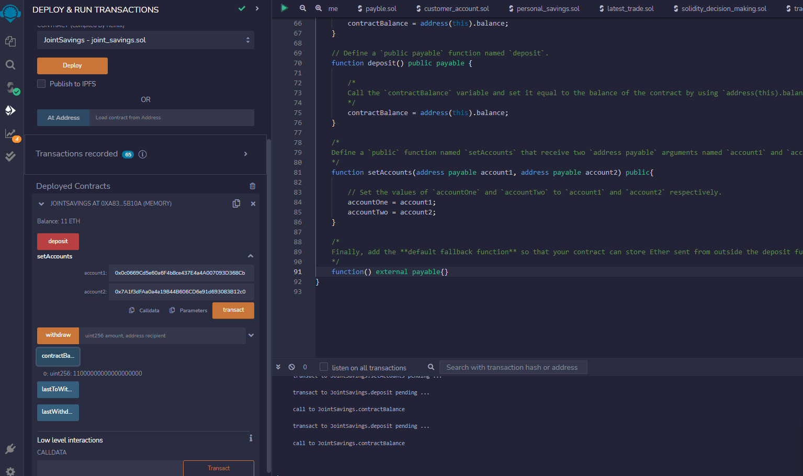

# Unit-20-Joint-Savings-Account

## Images confirming deposit and withdrawal transations.

1. Opening `0` balance and input : account 1 & account2

> Dummy account1 address: 0x0c0669Cd5e60a6F4b8ce437E4a4A007093D368Cb

> Dummy account2 address: 0x7A1f3dFAa0a4a19844B606CD6e91d693083B12c0

2. Input:  1000000000000000000 wei = 1 ETH , ready for deposit

3. Executed and show Balance: 1 ETH

4. Display `public` variable `accountBalance` : 1000000000000000000 wei

5. Executed deposit 10000000000000000000 wei = 10ETH

6. Display `public` variable `accountBalance` : 11000000000000000000 wei

7. Input: 5 ETH, ready for deposit

8. Executed deposit show balance : 16 ETH

9. Display `public` variable `accountBalance` : 16000000000000000000 wei

10. Input: Withdraw 5 ETH to accountOne

11. Executed withdrawl into accountOne, show balance = 11 ETH, display `accountBalance` = 11000000000000000000, display `lastToWithdraw` account, display `lastWithdrawAmount` amount.

12. Executed withdrawl (10 ETH) into accountTwo, show balance = 1 ETH, display `accountBalance` = 1000000000000000000, display `lastToWithdraw` account, display `lastWithdrawAmount` amount.

---